# 沈天昊的学习报告

                                                学号：18050500097

### 总结

开源硬件课程为我打开了一扇新的大门，在此之前我没有接触与硬件相关的知识，怀着对硬件的好奇选择了这门课程，经过四天的学习，我无比确信我将继续学下去。

***

## DAY 1：入门知识与学习途径介绍与引入

一、介绍Arduino

二、介绍三大相关软件

[Arduino](https://www.arduino.cc/)

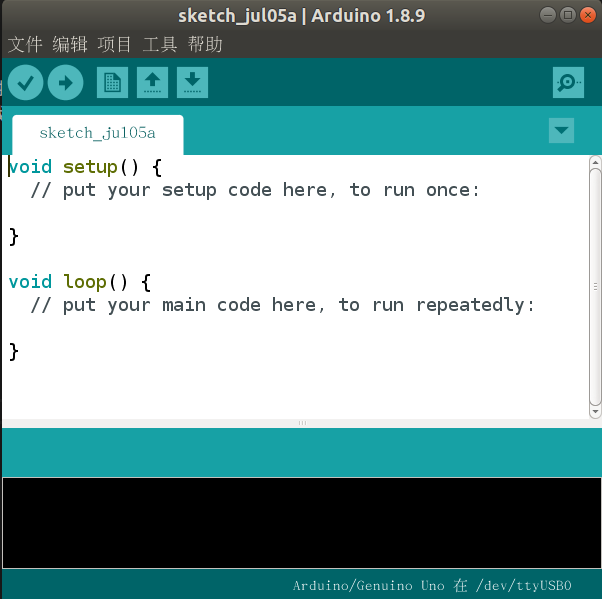

[Fritzing](http://fritzing.org/home/)

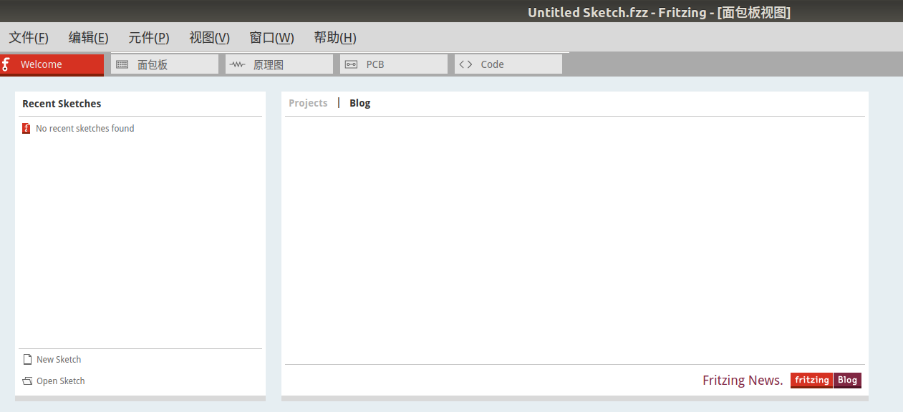

[Processing](http://iprocessing.cn/)

三、介绍Github的功能并注册github账号

[Github](https://github.com/)

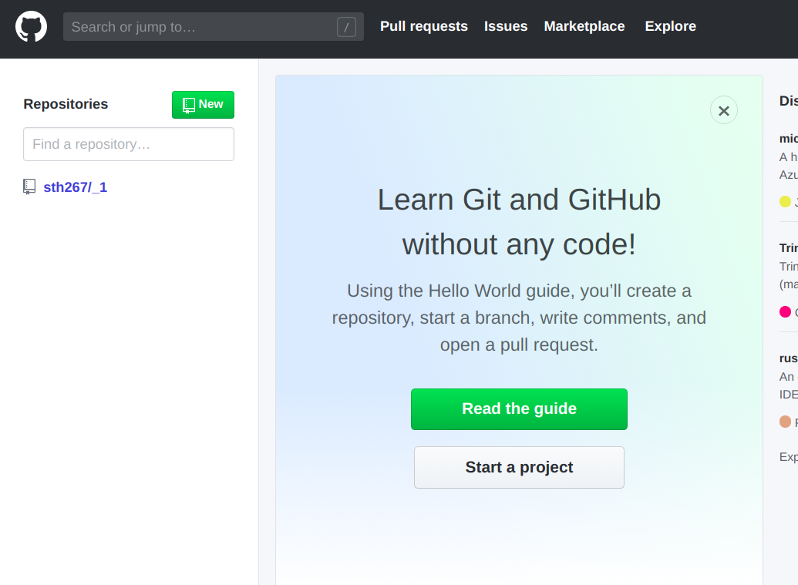

课后作业：软件下载与熟悉，注册github账号

收获：软件的准备，装上了linux系统，并熟悉了其终端的相关操作，学会了用终端操作文件夹和下载软件。

***

## DAY 2 ：Arduino软件编程

一、介绍摩尔斯电码

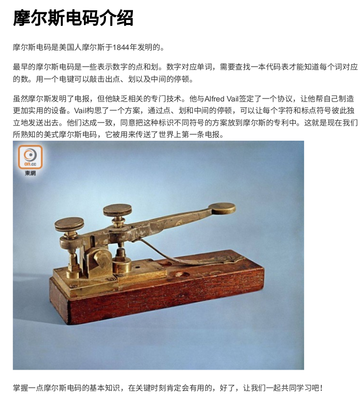

二、为Arduino编写自己的函数库

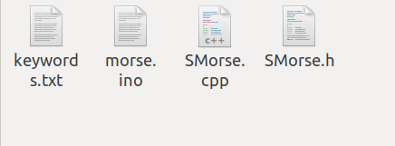

三、编写串口通信的程序

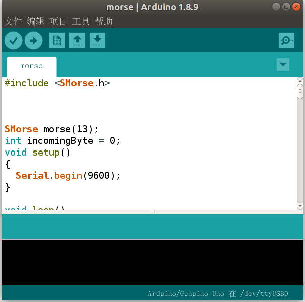

课后作业：自己编写通过串口输入字母、空格、回车的字符串使小灯以摩尔斯电码方式闪烁

收获：了解了摩尔斯电码，学会了Arduino上简单的设置输入输出引脚和控制每个引脚电平高低的方法

***

## DAY 3 认识电子原件及操作

一、介绍模拟Arduino的网站T

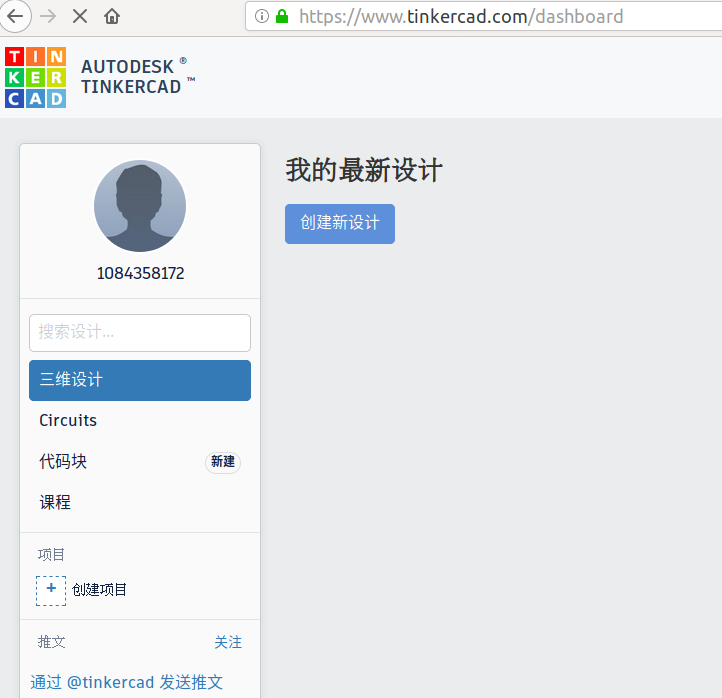

[Tinkercad](https://www.tinkercad.com/dashboard)

二、编写小车程序

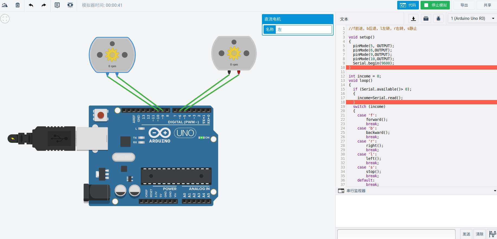

三、认识数码管，解码器组合的知识，编写数码管显示程序

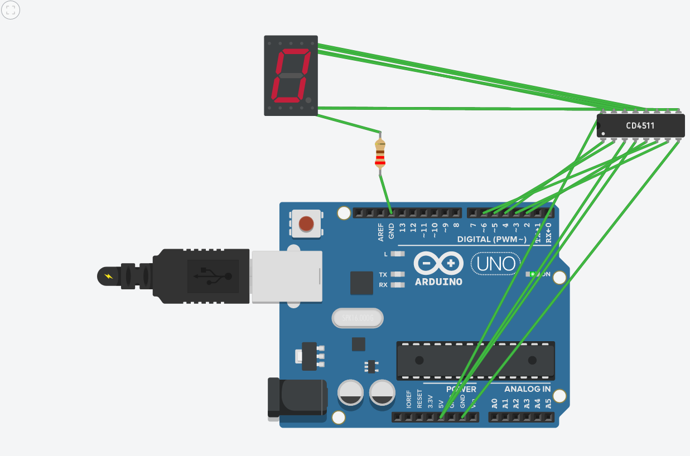

收获：学会了如何控制小车前进后退，左转右转等基本操作。学会了数码管，CD4511解码器的连接与使用，同时学会了将电脑github的密钥添加到github账户里，通过本地提交文件操作

## DAY 4 总结

一、对所学知识的回顾

二、摩尔斯电路模拟实验

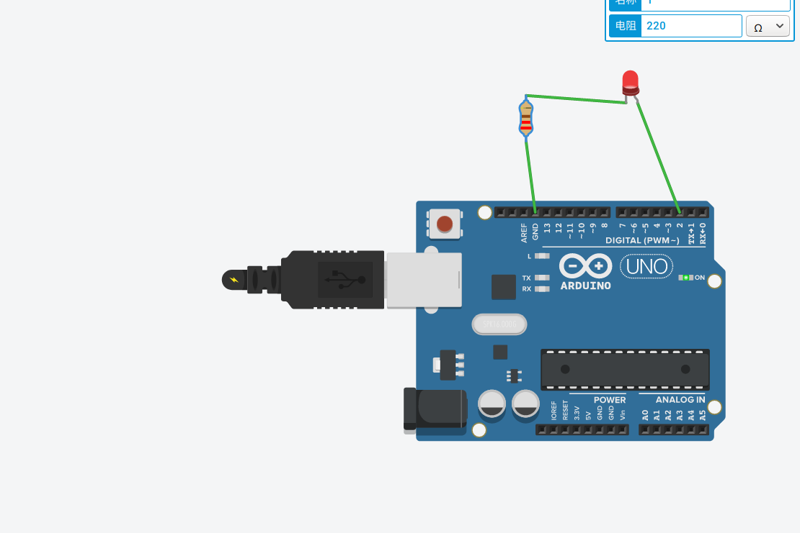

三、利用解码器的锁存实现不同数码管的数字显示

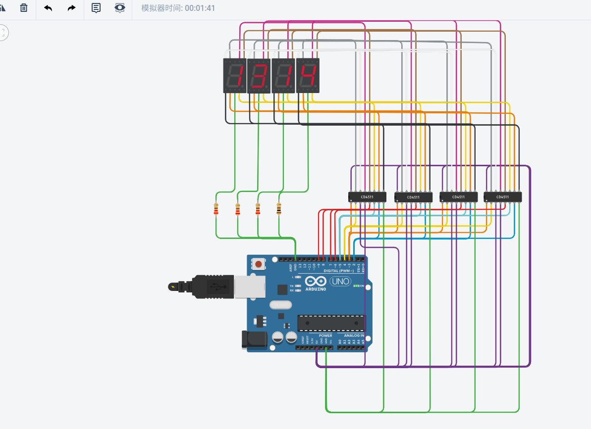

四、学会编写makedownde文件

收获：对之前的知识有了一个整理及综合运用

